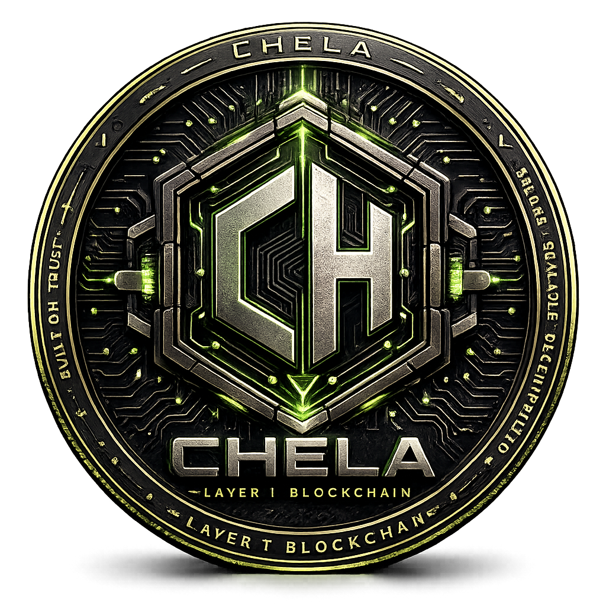

<p align="center">
  
</p>

# 🌟 CHELA-Layer1

**The Powerful Layer-1 Blockchain Ecosystem — Proudly Developed in Thailand 🇹🇭**

[](https://opensource.org/licenses/MIT)
[](https://github.com/uhulayer2-svg/CHELA-Layer1/stargazers)
[](https://www.rust-lang.org/)
[](https://www.python.org/)
[](https://ethereum.org/)

**CHELA-Layer1** คือ Layer-1 Blockchain ประสิทธิภาพสูงที่สร้างด้วย **Substrate + Frontier EVM** รองรับทั้ง Native Substrate Runtime และ Ethereum Smart Contract แบบเต็มรูปแบบ พร้อม Dashboard และ Block Explorer ใช้งานจริง

---

## ✨ Key Features

- **⚡ Hybrid Architecture** — Substrate Core + Full EVM Compatibility (Frontier)
- **🪙 CHLA Token** — ระบบโทเค็นขั้นสูง รองรับทั้ง Native และ EVM
- **🔥 Real-time Dashboard v1.3** — Streamlit UI ตรวจสอบธุรกรรมและโหนดแบบเรียลไทม์ (Port 8502)
- **📡 CHLA Scan** — Block Explorer ใช้งานผ่าน Cloudflare Tunnel
- **🌉 Python Bridge Tools v1.2** — ชุดสคริปต์สำหรับจัดการกองทุนและทดสอบระบบ
- **🛡️ Production Ready** — รองรับ Nginx + Cloudflare มาตรฐานระดับโลก

---

## 🇹🇭 พัฒนาโดยทีมนักพัฒนาไทย (UHU Layer2 Team)

โครงการนี้คือผลงานของชุมชนบล็อกเชนไทยที่มุ่งพัฒนาเทคโนโลยีจากประเทศไทยสู่ระดับโลก

---

## 🚀 Quick Start

### 1. Prerequisites
```bash
# ติดตั้ง Python dependencies
pip install -r requirements.txt
